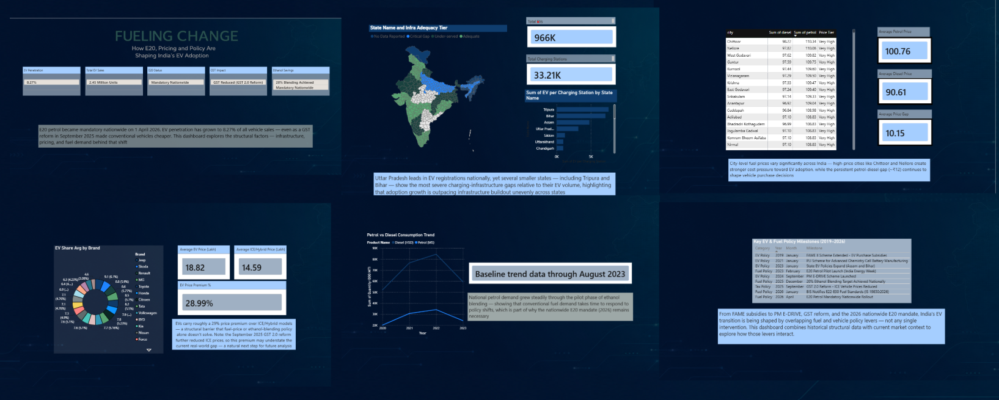

# Fueling Change: E20, Fuel Pricing & Policy Impact on India's EV Adoption

A 6-page interactive Power BI dashboard examining how India's 2026 nationwide E20 ethanol mandate, rising conventional fuel prices, and overlapping government policy interventions relate to the country's EV transition.

---

## Why this project

Most EV dashboards look at sales numbers in isolation. This one asks a different question: **is EV adoption actually connected to the policy and pricing environment around it — or is it happening on its own timeline, regardless of what the government does?**

E20 petrol became mandatory across India on April 1, 2026. That's a real, recent policy shift, not a hypothetical — and it sits alongside a string of other interventions (FAME subsidies, PM E-DRIVE, a GST 2.0 reform that made conventional vehicles cheaper) that all claim to be moving the needle on EV adoption. This dashboard tries to hold those claims up against actual state-level, city-level, and model-level data.

## What's inside

| Page | What it answers |
|---|---|
| **Where India Stands Today** | What does the EV market actually look like right now, post-E20? |
| **EV Landscape at a Glance** | Which states have the most EVs — and does charging infrastructure match that demand? |
| **Fuel Price Pressure** | How much does petrol/diesel pricing vary across cities, and where's the pressure highest? |
| **The Real Barrier: Price, Not Just Fuel** | Are EVs still meaningfully more expensive than ICE vehicles, even after policy support? |
| **Conventional Fuel Demand** | Did petrol/diesel consumption actually slow down as EV policy ramped up? |
| **Policy Timeline** | What's the full sequence of interventions that got India here? |

## A finding worth mentioning

The state with the most EVs registered (Uttar Pradesh) is **not** the state with the worst charging infrastructure problem. Tripura and Bihar — both far smaller markets — have a much more severe *EVs-per-charging-station* ratio. Looking only at total EV counts would completely miss this. It's a small example of why the dashboard separates absolute volume from relative strain, instead of reporting one number and calling it a day.

## Built with

- **Power BI Desktop** — data modeling, report design
- **DAX** — custom measures for ratio analysis, conditional filtering, dynamic text
- **Power Query** — cleaning and reshaping four structurally different source datasets
- **Custom Shape Map (TopoJSON)** — state-level India map, since Power BI's default map doesn't carry Indian state boundaries out of the box

## Data sources

- State-wise EV registration and charging infrastructure data
- City-wise fuel price data
- Vehicle model market data (pricing, segment, brand)
- National fuel consumption data, 2020-2023 (used as a pre-mandate baseline)
- Current 2025-26 market figures compiled from public sources (Autocar Professional, Vahan Dashboard, ChemAnalyst, Ministry of Petroleum and Natural Gas notifications) - cited in-dashboard

## Where this is honest about its limits

The historical dataset runs through 2023 - before the E20 mandate actually took effect. Rather than pretend that gap doesn't exist, the dashboard treats 2020-2023 as structural baseline evidence and bookends it with verified current-market figures. It's an associative analysis, not a causal one, and it says so.

City-level and state-level data are shown side by side, not merged, because they don't share a common geographic key - merging them would have implied a precision the data doesn't actually have.

## Files in this repo

- `India_E20_Impact_Dashboard.pbix` - the full dashboard
- `/data` - cleaned source CSVs used in the model
- `/screenshots` - page-by-page images for anyone without Power BI Desktop installed

---

*Built as an independent data analysis project applying Power BI, DAX, and applied statistics to a live Indian energy-policy question.*
